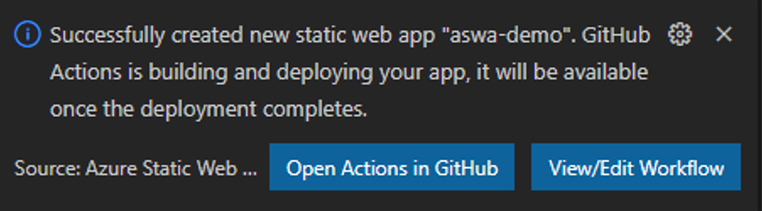

# Getting Started With Azure Static Web Apps & VS Code

Azure Static Web Apps are a convenient way to get your website deployed and accessible to the world regardless of your choice of frontend technology.  While it’s functionality may be limited for organizations that have a well established SDLC and CI/CD processes, it still has a place in small or large businesses.  Regardless of business size, cost is always a factor.  With Azure Static Web Apps, you can keep your costs to a bare minimum and even potentially free!  Some use cases that would greatly benefit from this Microsoft service are small business websites, and even large organization proof of concepts.

In this blog I will show you how to setup an Azure Static Web App and deploy an Angular application in under 30 minutes. As an added bonus, I will show you how to setup a staging environment to test your changes before going live! Keep in mind that while this blog uses Angular as the UI framework, you can use any frontend technology you would like even a plain old index.html file.

To get started we are going to need a few things all of which are 100% free.  Create the following accounts if you don’t already have them and ensure that GIT is installed on your machine.
- A Github Account (free)
- An Azure Subscription (free)
- Git SCM

I’m going to use Visual Studio Code (also free) for this blog as it has some wonderful Microsoft extensions that will make this process even simpler.  The extensions I recommend for this are
- Azure Account
- Azure Static Web Apps

If you want to use Azure Functions with your web app, I also recommend the Azure Functions extension.  All these extensions will allow you interact with your Azure resources directly in VS Code.
- Azure Functions

Let’s start by opening VS Code, installing the extensions (if you haven’t done so already) and connecting all your accounts.  Clicking the links above should install the extensions to VS Code.  You can also manually search for them in the VS Code extensions window and install them.  Installing them via this method may require a restart of VS Code.

Now that our extensions are installed, we will want to sign into our GitHub and Microsoft accounts through VS Code.  To do so, click the user icon at the bottom left of VS Code and click sign in to sync settings.

A window should popup at the top of VS Code to let you select which account you want to connect to.

Sign into your Microsoft Account that was created when you signed up for Azure.

## Application Setup

I’m going to use an Angular application for this example however just a plain index.html file will work.  Note that if you go down the index.html route or any other route where the framework doesn’t automatically initiate a local Git repository, you will need to set that up.  Setup a folder on your local machine to store the application.  I’m putting mine in the folder c:/angular/blog but you can put it wherever you would like.

In VS Code press ctrl + ` to open the terminal.

Navigate to your folder and use the Angular CLI to create a new project.

ng n {your project name here} --style=scss –routing=true

This will create a new Angular app which in turn creates a brand new local git repository.

Now open the new folder that was created with your app name in VS Code.  You should see an app that looks like this.  Note my app name was aswa-demo

Let’s save this code to our source control.  Click on the Git icon and enter the message initial app setup and publish the branch.

VS Code will ask for permission to connect to GIT.

Click allow and complete the sign in steps.

You will now get a prompt at the top of VS Code to setup the repository as either public or private.  By default, it will also use your project name as the repository name.  If that is not ideal you can change it.

Choosing either public or private has no impact on the following steps so pick whatever you are most comfortable with.

You should get a toast message on the bottom right of VS Code if all goes well.

If you run into issues, chances are you need to reauthenticate with Git.  Clicking open in GitHub shows the commit on GitHub.

Congratulations you are 2/3’s of the way there!  Next up setting up the Azure Static Web App.

Back in VS Code, click on the Azure icon and expand Static Web Apps.  You should see your default Azure Subscriptions or any additional ones you may have created.

Click the plus sign to create a new static web app.
You will get prompted to let the extension access GitHub.  Again, allow it and proceed with providing your credentials.

This is needed so that Azure can establish a CI/CD pipeline and set secrets in your git repository.

A new popup at the top of the screen will ask you to name your static web app.  By default, it will be your angular project name.

Next select a region that is best for you.

Now for the magic! You can pick between many popular frameworks.  In the case of this demo, we will pick Angular.  You can pick custom to define your own app.

Now we are prompted for the location of our application.  If you use custom routing this is where you would update the path.  If you deploy your apps at the root leave this as is.

For the artifact location, we need to make sure we update the \<project-name> placeholder with our Angular projects actual name.  In my case dist/aswa-demo.

After completing this another popup appears confirming the successful creation of a GitHub workflow.

Click Open Actions in GitHub. You will see that Azure initiated a commit against your master branch of a workflow file.  It also looks like there is something actively going on with the yellow spinning wheel.  This is the workflow for your ci/cd pipeline executing against the latest code in your repository.

GitHub spins up an instance of Ubuntu to compile your code using the Angular CLI behind the scenes.  Note you can also compile under MacOS and Windows or any combination of with GitHub actions!

After 2-3 minutes the application should compile and deploy successfully.  Note that by default Microsoft will spool up the free instance of Azure Static Web Apps so don’t worry!  If you need more power and additional features such as bring your own function apps vs the built in ones you can switch to the paid version which currently runs for $9 a month per app at the time of this blog.

Clicking on the job we can interrogate the process to see where things went wrong in case of an error.  In our case everything went as planned!

Click the build and deploy section to view what happened and scroll down to the bottom.  You will see some green text “Deployment Complete” “Visit your site at: \<url>”.

Click the url and you should see the default Angular web site.

For a real added benefit, you can see that an SSL certificate was issued to your site!

Ok this is great but what happens if we need to make changes?

Go back to Visual Studio Code

Navigate to src/app/app.component.html

Update the toolbar background color from #1976d2 to red and save the file.

Now click the git icon on the left and click the three dots in the top right of the source control header.

Click pull.  This will grab the workflow file that Azure created for the CI/CD pipeline and get your code in sync with the latest on the master branch.

Now right click your changed file and click stage changes.

Update the commit message to reflect our changing of the tool bar color and click the submit button   and finally click the sync changes button.

Navigate back to your GitHub repository and click the actions tab.  You will see your latest commit is being deployed!

Once it is complete, navigate back to your site and refresh the screen to see our red header signifying that our latest changes have been deployed.

While this will work for some small operations that work and test locally before deploying.  This isn’t ideal especially for larger dev groups.

It would be great to setup a real branching strategy so we can see our changes out in the wild before we publish them to production.  Let’s set that up now.

To do this we are going to have to create a new branch.  Since this is going to be acting as a staging environment for our application lets create a staging branch.

Back in Visual Studio Code click the three-dot button again and this time select branch -> create branch from.

Our familiar popup appears.  Enter the name staging and press enter.

Let's select our remote master branch "origin/master".

Now all we need to do is publish this branch.

Back in GitHub we can see the new branch

Note that when you go to the actions tab, there is no workflow running.  That is because currently we are only using the master branch to trigger the workflow.

Now we can save our code to this branch without fear of updating production!  But how can we see this live on the web?

Since we are already working in the staging branch lets update the app.component.html file again to restore the header color to the nice blue it was.

Save and commit the change to staging the same way we did previously. You should see a notification in GitHub if you did it right.

To see this change without overwriting production we will want to create a pull request against the master branch.  Click the Compare and Pull Request button.

From this screen we can see that we are going to merge staging into master and at the bottom we can see all the changes that are going to be going into master.

Create the pull request but ***do not merge it*** and then navigate to the actions tab.

A new workflow has kicked off but don’t worry. Pull requests will spin up a temporary environment that will get removed after we merge the content into the master branch.

The job should complete successfully.  Like before, open your build deploy tab and scroll down to get your launch link and click on it.  You will notice that the URL differs from the production URL.  A separate staging environment site has been issued to allow you to view the changes before committing to production.

Looking at production we can still see out beautiful red header.

Looking at the staging environment we can see our beautiful blue header restored to all of its glory.

Since we know everything looks great now in our staging environment lets merge the pull request into master.
Go back to the pull requests tab and click on the pull request.

Click Merge Pull Request to close it and merge it to master.  This will kick off our production build.

We can see the workflows running in the actions tab.

Once the merge is complete the staging environment will be decommissioned.  Navigating to it you will get a 404 Not Found.  The next time you create a pull request against master a new staging environment will be provisioned.

Going back to production you will notice the header has returned to its lovely blue self.

There you have it!  A fully functioning web site with a production and staging environment that is managed for you and free!  There are still many other things in the works for Azure Static Web Apps.  I hope you have found this tutorial helpful.  Stay tuned for more updated!